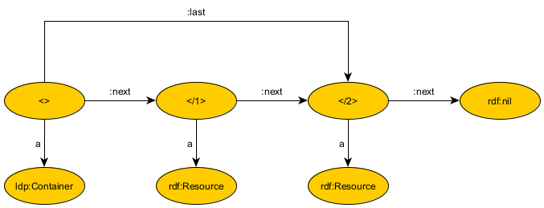

# Stack/Queue Container

## Idea
The stack and queue are commonly used data structures. Use cases for agents that may profit from a Linked Data Platform container that implements this functionality are easy to think of and include e.g. the storage of machine events.

## Variants
- Stack - FILO (first in last out)
- Queue - FIFO (first in first out) 

## Operations
- push (add one new resource)
- pop (remove next resource)
- peak (view next resource)

## Concept Variants
1. linked list between all resources
2. every resource has a property and these properties can be ranked, e.g. numbers

With variant 2, when a resource is popped from the stack/queue, the other properties remain. Newly pushed resources always need a larger property, which can lead to problems. Therefore, variant 1 seems superior.

## Should we use the existing RDF List?
In a RDF list, every element in the list is an instance of the rdf:List class and has a resource connected as value with the rdf:first property. The elements are connected by the rdf:rest property to build the list. This structure makes sense because a resource can be part of more then one list and thus the rdf:List instances are necessary to clarify which element is the next one in one certain list.

However, the Stack/Queue Container always contains one list only. Therefore, a simpler structure that connects the resources itself is sufficient.

See an overview of the structure below.



## Pseudo Code of Operations
### push (stack)
```
push <e>
<e>.next = <>.next
<>.next = <e>
```
### push (queue)
```
push <e>
<e>.next = nil
last.next = <e>
last = <e>
```
### pop
```
if (<>.next==nil) return nil
<e> = <>.next
<>.next = <>.next.next
return <e>
```

## HTTP Requests
- Container/POP - POST request only (POST is debatable to remove one resource from the container but fits best from all options. PUT doesn't fit because of idempotency)
- Container/PUSH - POST request only (POST because we add a subelement to the container)
- Container/PEAK - GET request only (GET because we want to receive one resource but cahnge nothing)


 
